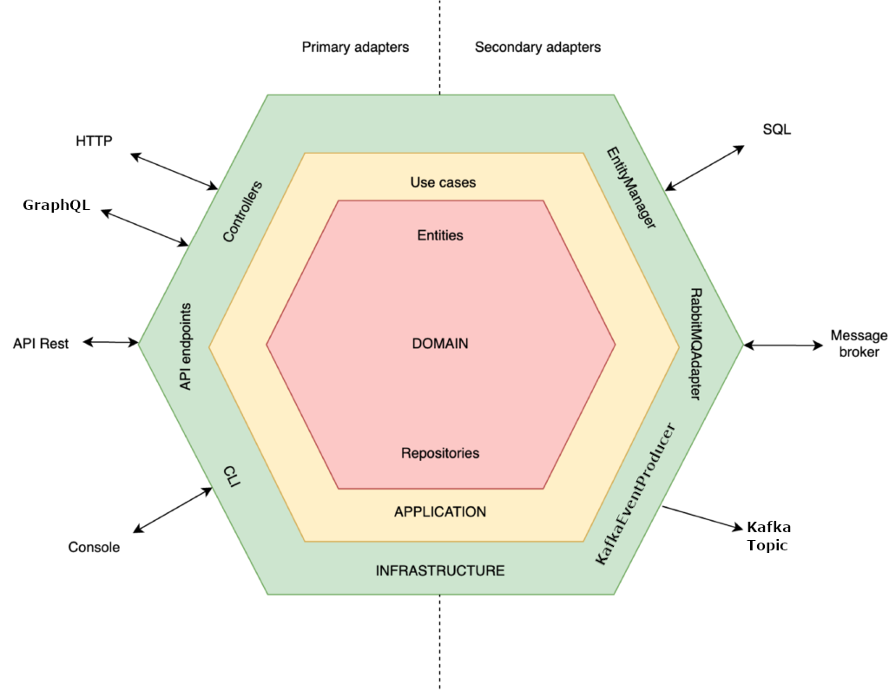

# Comments and thoughts about the code

Hi! This is Marc (your new anti-squatter detective 🥸), I will write down some comments and ideas about the code I'm writing to explain a bit why I take some decisions or another thoughts.

I've tried to keep the project as clean and minimalistic as possible, developing using TDD and applying the DDD & hexagonal patterns using [CQS](https://martinfowler.com/bliki/CommandQuerySeparation.html). This image represents what I try to achieve:


## Stack
- Kotlin (1.8.22, JDK 17)
- JUnit for unit tests
- E2E tests will be written in Gherkin, using Cucumber.
  Developed using IntelliJ IDEA 2023.3 (Community Edition)

## How to run
```shell
./gradlew bootRun -P inputFiles="2016-readings.csv 2016-readings.xml"
```
If you want to add more files you have to place them inside the `src/main/resources/data` folder.

## Testing
- I'm approaching the development by first defining tests and then coding, you will find the features in `resources/features/fraudDetector.feature`.
- I'm using e2e tests, usually this is used with a virtualized environment so it has the same integration with dependencies as in production.

## Code
- In this case we have only files in local to read. I named the classes that deal with it after that, so they're `readers`. In case this project would handle other sources as databases, I'd rename it to `repository` and adapt it.
- The provided `CSV` and `XML` files are short and I'm reading them whole in memory, but in a production scenario this should not be done since they could be a million time longer, so I'd choose a way to read them by chunks. 
- Each file is read by 12 lines per client as requested in the instructions, but it should be verified by their client ID. It would add reliability and the possibility to read a file in parallel. I'm also assuming that a client in one file is not in another file and should not be taken into account.
- In order to calculate the median, we will use the average between the two median in case the amount of readings per client are pair (in this case it's everytime since it's 12). Depending on the business rules we could switch to evaluate both medians instead.

## Next Steps
- Read different files in parallel.
- Fix the table formatter so it's properly indented.
- This app could & should be embedded in a docker. I'd create a dockerfile to generate an image with the dependencies needed for the app to run and use that image in a docker-compose file to run it from CI.
- Improve e2e testing assertion to not depend on printed lines. Since this is a CI app that only displays a table, I'm taking that as the output. I should only take the data inside that table internally instead.